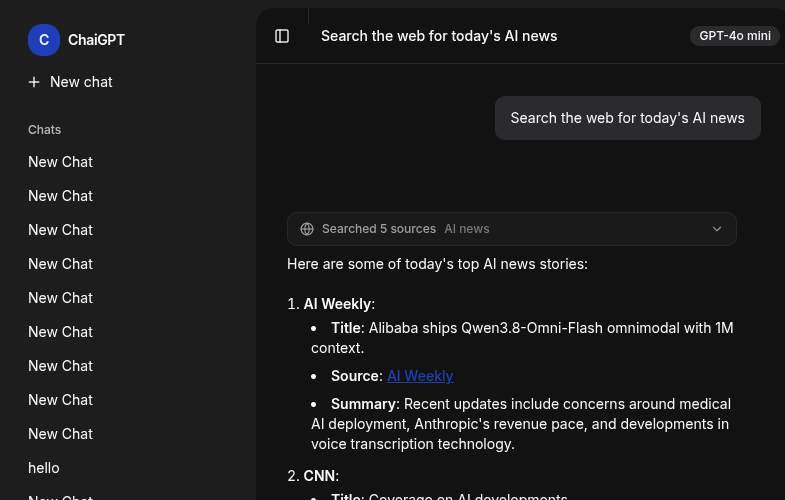
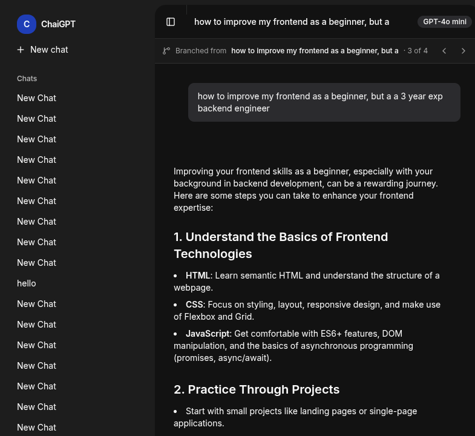
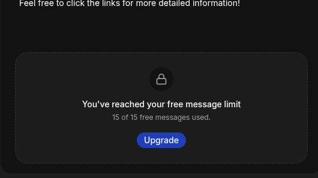

# ChaiGPT

A ChatGPT-style AI chat app built with Next.js, the Vercel AI SDK, and Prisma. The model can call a web search tool mid-conversation, stream the tool execution, and answer from real-time results; users can branch a conversation from any message and continue independently; and every account gets a server-enforced trial quota with a clear upgrade state when it runs out.

**Links:** [Repository](https://github.com/ArmanRuhit/chai-gpt-build) · Live demo: _coming soon_ · Demo video: _coming soon_



## Features

**AI tools**

- **AI tool calling** — the model decides when it needs the web, calls the `web_search` tool, and keeps generating from the results (multi-step, up to 5 steps)
- **Streamed tool execution** — search progress, results, and failures render inline as the response streams
- **Web search via Tavily** — provider adapter normalizes results into `title`, `url`, `snippet`, `publishedAt`
- **Tool call persistence** — every invocation is stored in a queryable `ToolCall` table; full message parts replay on reload

**Conversation branching**

- **Branch from any message** — fork a chat into a new conversation that keeps the shared history up to the fork point
- **Branch navigation** — header bar with `Branched from <title>` and a sibling switcher (`N of M`, prev/next)
- **Branch management** — rename, pin, and delete like any chat; deleting a parent keeps its branches alive
- **Sidebar tree** — branches indent under their parent with a branch icon



**Trial system**

- **Server-enforced quota** — `TRIAL_MESSAGE_LIMIT` free messages per user; past-limit requests are rejected in the chat route with `403 { code: "TRIAL_LIMIT_REACHED", used, limit, remaining }`, not just hidden in the UI
- **Atomic consumption** — usage increments via a single conditional `UPDATE ... WHERE trialMessagesUsed < limit`, so two parallel sends can't overshoot the quota
- **Only new messages are charged** — retrying or regenerating an already-saved message neither consumes quota nor blocks
- **Per-user overrides** — `User.trialLimitOverride`: positive value → absolute limit, `-1` → unlimited, `null` → the env default
- **Live UI state** — remaining count by the composer, blocked/upgrade panel at zero, re-synced from the server after sends and mapped from the 403 payload on stale tabs

**Chat**

- Multi-provider model support (OpenAI, DeepSeek) via the AI SDK provider registry
- Per-conversation model selection at chat start
- Provider credit exhaustion (402/quota errors) surfaces as a clear inline state instead of a generic retry banner
- Clerk authentication, PostgreSQL persistence with Prisma

**Landing page**

- Public marketing page at `/` for signed-out visitors (signed-in users are redirected to `/new`) — seven sections, one-shot entrance/scroll motion with reduced-motion fallbacks, and real product screenshots

## Tech Stack

- Next.js 16 (App Router) · React 19 · TypeScript · Tailwind CSS 4
- Vercel AI SDK 7 (`ai`, `@ai-sdk/openai`, `@ai-sdk/deepseek`, `@ai-sdk/react`)
- Zod 4 for tool input schemas
- Tavily Search API
- TanStack Query for server-state caching (conversations, messages, branch context)
- Prisma 7 + PostgreSQL
- Clerk authentication
- Motion (`motion/react`) for landing-page animation
- Bun for the local toolchain (`bun install`, `bun run …`)

## Getting Started

Prerequisites: [Bun](https://bun.sh) 1.4+, a PostgreSQL database, a Clerk application, and (for web search) a Tavily API key.

1. `bun install`
2. Create `.env.local` with the variables below
3. `bunx prisma generate` then `bunx prisma migrate dev`
4. `bun run dev` and open http://localhost:3000

## Environment Variables

| Variable | Description |
| --- | --- |
| `DATABASE_URL` | PostgreSQL connection string |
| `OPENAI_API_KEY` | OpenAI API key |
| `DEEPSEEK_API_KEY` | DeepSeek API key |
| `TAVILY_API_KEY` | Tavily web search API key (required for search) |
| `CLERK_SECRET_KEY` | Clerk secret key |
| `NEXT_PUBLIC_CLERK_PUBLISHABLE_KEY` | Clerk publishable key |
| `NEXT_PUBLIC_CLERK_SIGN_IN_URL` | Sign-in route |
| `NEXT_PUBLIC_CLERK_SIGN_UP_URL` | Sign-up route |
| `NEXT_PUBLIC_CLERK_SIGN_IN_FALLBACK_REDIRECT_URL` | Post sign-in redirect |
| `NEXT_PUBLIC_CLERK_SIGN_UP_FALLBACK_REDIRECT_URL` | Post sign-up redirect |
| `TRIAL_MESSAGE_LIMIT` | Free messages per user. Missing → `15`, invalid → `0`, valid number → its value (`-1` → unlimited). Optional — the default applies when unset. |

Get a free Tavily key at [tavily.com](https://tavily.com) (1,000 credits/month). If the key is missing, the tool returns a clear "Web search is not configured" error instead of crashing the request.

## Architecture

### Chat request flow

1. `app/api/chat/route.ts` validates auth/ownership, and for new user messages consumes one trial slot (`tryConsumeTrialMessage`) — rejected requests never persist or stream.
2. The user message is persisted, then `streamText` runs with `tools: chatTools` and `stopWhen: isStepCount(5)`, so the model can search, read results, and continue answering in the same request.
3. Tool execution streams over the UI message protocol — the client sees `input-streaming`, `input-available`, `output-available`, or `output-error` states.
4. On stream end, messages (including tool parts) are saved to `Message.parts`, and each invocation is upserted into `ToolCall`.

### Web search tool

- `features/ai/tools/index.ts` — `chatTools` registry (add new tools here)
- `features/ai/tools/web-search.ts` — the `web_search` tool: description, Zod input schema, `execute` calling Tavily
- `features/ai/tools/search/tavily.ts` — provider adapter (10s timeout, error mapping, result normalization)
- `features/ai/tools/types.ts` — client-safe `ChatUIMessage` type for typed tool parts

The model chooses when to call the tool (`toolChoice: "auto"`). The tool description is the main lever for how eagerly it searches.


### Conversation branching

A branch is a `Conversation` row linked to its parent, with the fork point recorded:

- `Conversation.parentConversationId` — null for root chats, set for branches
- `Conversation.forkedAtMessageId` — the message the branch continues from

Creating a branch copies every message up to and including the fork point into a new conversation inside a transaction, preserving `createdAt` and `parts` — so tool cards and citations replay in the branch automatically. A branch is still just a conversation, so the chat route, history loading, and rename/pin/delete all work unchanged.

- `features/branching/actions/branch-actions.ts` — `createBranch` (transactional prefix copy), `getBranchContext` (parent + siblings forked from the same message)
- `features/branching/hooks/use-branches.ts` — `useBranchContext`, `useCreateBranch`
- `features/branching/components/branch-bar.tsx` — `Branched from <title>` plus the `N of M` sibling switcher
- `features/conversation/components/app-sidebar.tsx` — `buildConversationTree` nests branches under their parent

Deleting a parent chat keeps its branches (`onDelete: SetNull`); the delete dialog tells the user how many branches will survive.

### Trial system

The quota lives on the user row and is enforced in one place:

- `features/auth/trial-config.ts` — pure config module (no Prisma, side-effect free on import):
  - `parseTrialMessageLimit(raw)` — whole-string parsing: missing → `15`, valid finite number → its value, anything else (including `"2abc"`) → `0`
  - `readTrialMessageLimitRaw()` — the environment reader (`Bun.env` under Bun, `process.env` on Node)
  - `resolveTrialLimit(override)` — override `-1` → unlimited; override `> 0` → absolute; otherwise the env value
  - `buildTrialStatus(used, limit)` — remaining count, clamped at 0; `remaining: null` when unlimited
- `features/auth/trial.ts` — `getTrialStatus(user)` (read-only) and `tryConsumeTrialMessage(user)`: resolves the limit, then atomically consumes a slot with `updateMany({ where: { id, trialMessagesUsed: { lt: limit } }, data: { increment: 1 } })`. Zero rows updated → blocked; this is what makes parallel sends safe without a transaction.
- `app/api/chat/route.ts` — the gate: inside the "new message" branch only, so retries/regenerations are never charged.
- `features/auth/components/trial-limit-notice.tsx` — blocked panel + upgrade dialog; `features/auth/action/trial-status.ts` and `features/auth/trial-client.ts` keep the UI in sync and parse the 403 payload from the AI SDK error.

Verify the parser under Bun (import-based, since the module stays side-effect free):

```bash
TRIAL_MESSAGE_LIMIT=2abc bun -e 'import { parseTrialMessageLimit } from "./features/auth/trial-config.ts"; console.log(parseTrialMessageLimit(Bun.env.TRIAL_MESSAGE_LIMIT))'
# → 0   (TRIAL_MESSAGE_LIMIT=25 → 25, unset → 15)
```



### Persistence

| Model | Purpose |
| --- | --- |
| `User` | Clerk identity + trial state (`trialMessagesUsed`, `trialLimitOverride`) |
| `Conversation` | Thread metadata, per-thread model, branch link (`parentConversationId`, `forkedAtMessageId`) |
| `Message` | Full `parts` JSON, so tool calls replay in the UI |
| `ToolCall` | Queryable audit trail: `toolName`, `input`, `output`, `state` (`PENDING`/`SUCCESS`/`ERROR`), `errorText`, timestamps |

### UI

- `features/conversation/components/tool-call.tsx` — collapsible tool card: spinner while searching, source list with links and snippets when done, destructive alert on failure
- `features/conversation/components/chat-messages.tsx` — renders text, reasoning, and tool parts; hover action to branch from a message; retry banner when a response fails
- `features/branching/components/branch-bar.tsx` — branch lineage and sibling navigation under the chat header
- `features/conversation/components/conversation-view.tsx` — remaining-messages counter above the composer; blocked panel replaces it at zero
- `app/(marketing)/page.tsx` + `components/landing/*` — the public landing page

## Demo Prompts

- `Search the web for today's AI news headlines` — basic tool call
- `What is the latest Next.js version and its release date? Confirm with two independent sources, then list breaking changes mentioned in the release notes.` — multi-step verification
- `Summarize the second source you found and give me its URL.` — follow-up that reuses stored tool results
- **Branching:** open any chat, hover a message → branch icon → ask a different follow-up in the new branch; the header shows `2 of 2` and the sidebar nests the branch under its parent
- **Trial:** send messages until the counter hits zero — the composer is replaced by the blocked/upgrade panel (set `TRIAL_MESSAGE_LIMIT` low, e.g. `3`, to see it quickly)

## Deployment (Coolify)

The app deploys like any Node/Next.js server app; notes for a self-hosted [Coolify](https://coolify.io) instance:

1. **Postgres** — create a PostgreSQL database resource and keep its connection string (use the internal URL for same-server communication).
2. **Application** — create a new resource → Application → connect this GitHub repo. Coolify's Nixpacks buildpack detects Bun (`bun.lock`) and Next.js. Set:
   - Build command: `bunx prisma generate && bun run build` — the generated Prisma client under `lib/generated/prisma` is only partially committed, so generate before building
   - Start command: `bun run start`
3. **Environment variables** — add every variable from the table above. Set the `NEXT_PUBLIC_*` values as build-time variables (they're inlined by Next.js) and the rest as runtime variables. Set `TRIAL_MESSAGE_LIMIT` explicitly rather than relying on the 15 default.
4. **Migrations** — apply the schema to the production database: `bunx prisma migrate deploy`. On Coolify, add it as the application's pre-deployment command, or run it once from the container terminal after the first deploy.
5. **Domain** — point a domain at the Coolify proxy (TLS is issued automatically). Add the domain to your Clerk instance and set the sign-in/sign-up redirect URLs for production.
6. **Verify** — open `/` (public landing, signed out), sign in, send a message, and check the counter.

Notes:

- Public routes: `/`, `/sign-in(.*)`, `/sign-up(.*)`, `/robots.txt`. Everything else is protected by Clerk middleware (`proxy.ts`).
- `prisma.config.ts` loads `.env.local` locally; in production it reads `DATABASE_URL` from the environment.

## Scripts

- `bun run dev` — dev server
- `bun run build` — production build
- `bun run start` — production server
- `bun run lint` — ESLint
- `bunx prisma generate` — regenerate the Prisma client after schema changes
- `bunx prisma migrate dev` — create/apply migrations locally
- `bunx prisma migrate deploy` — apply migrations in production
- `bunx prisma studio` — browse the database

## Roadmap

- Phase 1 (done): web search tool calling
- Phase 2 (done): conversation branching
- Phase 3 (done): trial system with server-side quota
- Landing page (done): public marketing page with motion and real screenshots
- Next ideas: search-result caching, per-request search toggle, message editing with auto-branch, branch-aware regenerate, billing integration for the upgrade path
